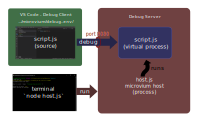
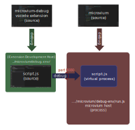
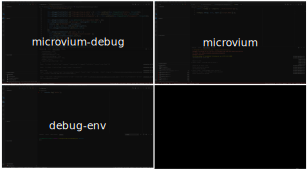

# Debugging the Debugger

This is about debugging the Microvium debug process. At the moment, this only documents the case of debugging the comprehensive VM, since we don't have a debugger on the compact VM yet.

## Debugging a Microvium application as an end user

There's an example folder `debug-env` which is set up for testing out the Microvium debugger. This has two files:

  - `script.js`: Entry point for the Microvium virtual process (i.e. a Microvium script that the user wishes to debug).

  - `host.js`: Entry point for the host process that will run the Microvium script. It uses Microvium as a library, and links directly to it (the `microvium` library) using a relative path (which is not how the end user would debug Microvium, but it works for the case laid out in this document).

Putting on your end-user hat, an end user would want to debug `script.js` using vscode by:

  1. Launching the host (`host.js`) from the terminal
  2. The `host.js` creates the [empty] Microvium virtual machine, specifying that it must be in debug mode.
  3. The Microvium virtual machine starts a a websocket server for receiving debug commands. In this example, let's assume this is on port 8080.
  4. `host.js` runs `script.js` in the virtual machine
  5. Since Microvium was started in debug mode, the host process will become suspended at the entry of `script.js` while it waits for a debug client to connect.
  6. The user would have their project directory (`.../debug-env`) open in vs-code. They would use a launch configuration to start debugging, attaching to the `script.js` virtual application on port 8080.
  7. (Then the user can step through their code as necessary)

## Higher-order debugging

Taking our end-user hats off, and putting our Microvium-developer hats on, we want to additionally be able to debug all of the parts in the above diagram:

  1. We want to be able to debug the VS Code extension that is acting as the debug client

  2. We want to be able to debug the host process (`host.js`) and especially the `microvium` virtual machine running in the host process, since this is what is processing the debug commands.

## How To

  1. Open the `microvium` project in VS Code.

  2. Launch the `host.js` host file using the debug launch profile named "debug-env/host.js". This will start the host, which will in turn run the Microvium virtual machine in debug mode. The debug terminal should display something like "Microvium-debug is listening on ws://127.0.0.1:8080". At this point, the Microvium virtual process is suspended at the script entry point (entry to `script.js`), along with its host, waiting for a debug client to connect.

  3. Open the [`microvium-debug`](https://github.com/coder-mike/microvium-debug) project in VS Code. Launch the extension in debug mode -- this will start a new instance of VS Code, with `[Extension Development Host]` in the application title. In this new instance of VS Code, navigate to the `debug-env` subfolder of VS code, as if you were a user who now wanted to debug `script.js`.

  4. Still in the newly-launched VS Code instance, open `script.js`, add a breakpoint (if you like), and press `F5` to attach a debugger to the already-running `script.js` file using the launch profile `script.js - Attach` (this is the only profile in the project).

Note: while you can launch multiple debug sessions in one VS Code window, I personally find it useful to separate each debug session in a different window, since the 3 debug sessions correspond to 3 distinct projects:

  1. `microvium-debug` project (for debugging the VS Code extension)
  2. `microvium` project (debugging Microvium)
  3. `debug-env` project (the end-user's "project" -- for debugging `script.js`)

Given how complicate it is to get my head around running 3 debuggers for 4 processes at once, I take it one step further and arrange these Windows on my desktop in the same arrangement as the above diagram so I can remember what's what. YMMV.

## Note to maintainers

This documentation is in the Microvium repo because debug-env is in the microvium repo and it made sense to put them together. The debug-env directory is in the microvium repo because microvium needs to run in debug mode from the entry point `host.js`.